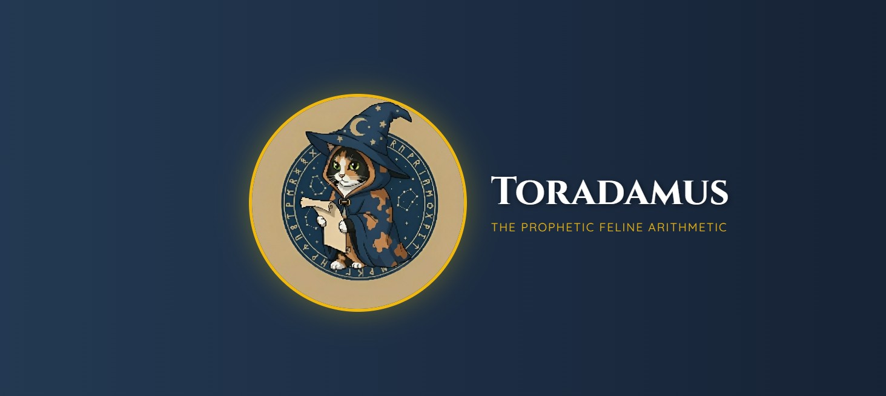

<p align="left">
  
</p>


# Toradamus – Juego de Predicción Matemática

## Descripción

**Toradamus** es un juego matemático implementado en Python basado en un truco clásico de sumas. A partir de un número inicial elegido por el jugador, el sistema es capaz de **predecir el resultado final desde el primer turno** y alcanzarlo de manera determinista a lo largo del juego.

El proyecto está diseñado para **modelar explícitamente el estado del juego y su evolución por turnos**, separando de forma clara la lógica matemática del flujo de interacción con el usuario.


## Idea matemática

El juego se apoya en la siguiente regla:

* En cada turno, el número elegido por el jugador (`n2`) y el número calculado por el sistema (`n_pc`) **suman siempre 999**.
* Esta simetría garantiza que, tras un número finito de turnos, la suma parcial alcance exactamente la **predicción inicial**.

Este principio permite que el resultado final sea conocido desde el inicio, independientemente de las elecciones del jugador.


## Características principales

* Predicción matemática determinista desde el primer turno.
* Actualización explícita del **estado del juego** (suma parcial).
* Separación clara entre:

  * lógica del juego
  * control de flujo
  * interacción con el usuario
* Validaciones mediante **excepciones explícitas**.
* Código legible, modular y fácil de extender.


## Estructura del proyecto
```bash
toradamus-project/
│
├── backend/                       
│   ├── api_server.py              # Servidor Flask API
│   ├── result_prediction.py       # Lógica matemática 
│   ├── main.py                    # Script de consola 
│   └── requirements.txt           # Dependencias Python
│
├── frontend/
│   ├── index.html                 # HTML modularizado 
│   │
│   ├── css/
│   │   ├── styles.css            # Estilos base y variables
│   │   ├── header.css            # Estilos del header animado
│   │   ├── game.css              # Estilos de los paneles de juego
│   │   └── animations.css        # Keyframes y animaciones
│   │
│   ├── js/
│   │   ├── config.js             # Configuración y constantes (quotes)
│   │   ├── animations.js         # Efectos visuales (sparkles, explosión)
│   │   ├── game.js               # Lógica del juego (estado, turnos)
│   │   ├── ui.js                 # Manipulación del DOM (typewriter, updates)
│   │   └── main.js               # Inicialización y event listeners
│   │
│   └── assets/
│       └── unnamed.jpg           # Imagen del gato Toradamus
│
└── README.md                      # Documentación del proyecto
```


## Flujo del juego

1. El jugador ingresa un número entero de dos o más cifras.
2. El sistema calcula la **predicción final** y la suma parcial inicial.
3. En cada turno:

   * el jugador ingresa un nuevo número,
   * el sistema responde con su complemento a 999,
   * la suma parcial se actualiza.
4. El juego termina cuando la suma parcial coincide con la predicción.


## Requisitos

* Python 3.9 o superior

No se requieren librerías externas.


## Ejecución

```bash
python main.py
```


## Objetivo del proyecto

Este proyecto tiene un enfoque **didáctico y conceptual**, orientado a:

* modelar procesos dinámicos correctamente,
* aplicar principios de diseño limpio,
* y demostrar buenas prácticas en Python más allá de la simple implementación funcional.


## Autores:
- **Oriana Giraldo**
- GitHub: [@Ori-G-A](https://github.com/Ori-G-A)
- **Luis**  
- GitHub: [@LuisJRubioH](https://github.com/LuisJRubioH)

Proyecto desarrollado con fines educativos y de exploración de diseño lógico en Python.
